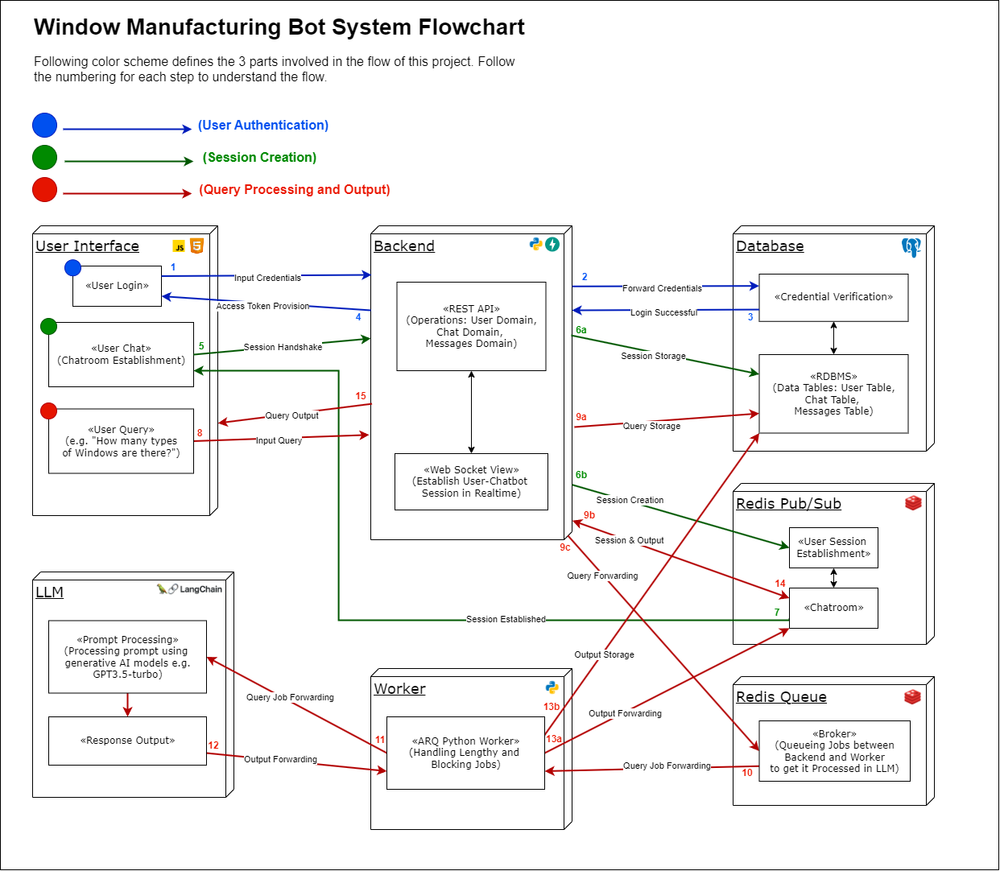
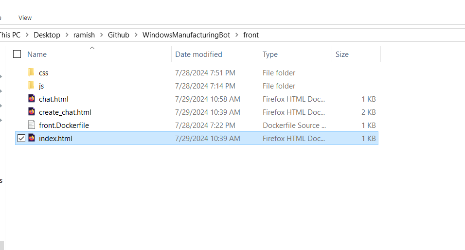

# Window Manufacturing Chatbot


Window Manufacturing Chatbot is a web-based application designed to assist users with questions related to window manufacturing. Leveraging the power of Large Language Models (LLMs) via OpenAI, the chatbot provides detailed and accurate information about different types of windows, manufacturing processes, installation, maintenance, and more. The application ensures a smooth conversational context to handle follow-up questions effectively.

## 🏛 Architecture

This architecture facilitates a robust and scalable chatbot llm-based application, capable of handling multiple user interactions and maintaining context throughout the conversation.





## 💻 Technologies

- **FastAPI**: Serves as the web framework for building the API.
- **Redis Queue and Pub/Sub**: Used for managing tasks and message brokering.
- **Sockets**: For real-time communication between the client and server.
- **Docker**: Containerizes the application for easy deployment.
- **LangChain**: Manages conversational context and dialogue flow.
- **OpenAI LLM**: Provides the intelligence behind the chatbot’s responses.

## 🚀 Getting Started

To start using the Window Manufacturing Chatbot, follow these steps:

## ✅ Prerequisites

Before you begin, ensure you have installed:

- [Docker](https://www.docker.com/products/docker-desktop)
- [Git](https://git-scm.com/downloads)

## 🔧 Setup and Installation

### ➡️ Step 1: Clone the Repository

1. **Clone the Repository**:
   
    ```bash
    git clone https://github.com/RamishUrRehman007/WindowsManufacturingBot.git
    ```

### ▶️ Step 2: Running the Application

Note: Please make sure you define openai_api_key if you dont have no worries i sent this in a email


Navigate to the project directory and use Docker Compose to start the application:

1. **Build the Deployment Docker Image**:
   
    ```bash
    docker-compose up -d postgres
    ```
    
2. **Run migration.sh and Create Tables Inside DB Container**:
   
    ```
    docker-compose exec postgres sh -c '/mnt/migration.sh -d window_manufacturing_bot'
    ```
    - **Note**: You only need to do this once unless there are some changes in our DB schemas.
    - If you encounter a permission error, run the following command:
        ```
        docker-compose exec postgres sh -c 'chmod 777 mnt/migration.sh'
        ```
    
3. **Build and Up All Containers**:

    ```
    docker-compose up
    ```
    - Now, review the resources you are about to create, update, or delete to ensure they are what you expect
    


## 🌐 Accessing the Application

Open your directory and click on index.html file.



**WindowManufacturingBot**


**User Ramish joins chat** 


**User Ramish asks query** 


**AI-LLM Generates a Response** 


## ⏹ Stopping the Application
To stop the application, use `Ctrl+C` in the terminal where Docker Compose is running, or run `docker-compose down` in a separate
